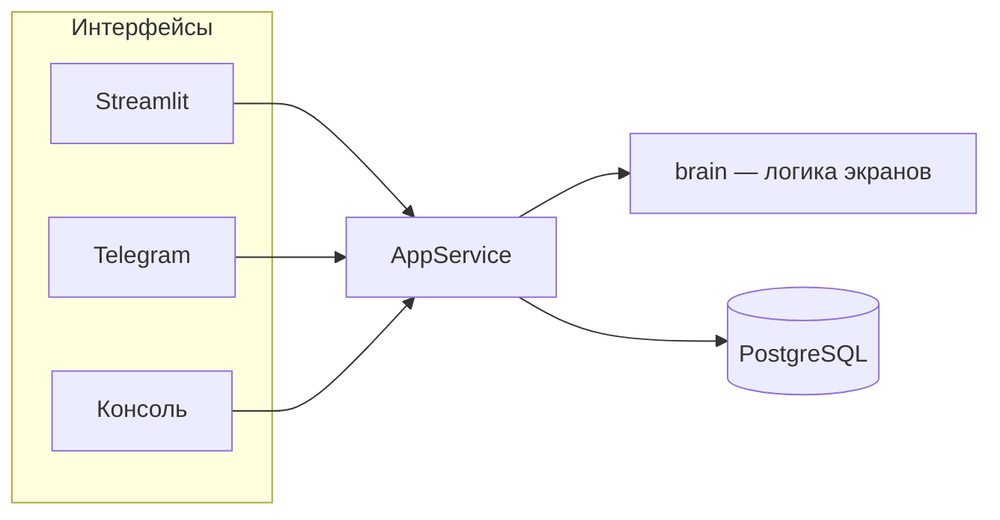

# wvs_bot

**Interactive survey bot for the [World Values Survey](https://www.worldvaluessurvey.org/) (WVS) framework.**  
Participants answer a short questionnaire and get immediate feedback: value indices, nearest country, and their place relative to a large reference sample.

---

## What problem does this solve?

Social science needs both **data collection** and **instant feedback** for respondents. This project:

- collects answers to a WVS-style questionnaire;
- stores them in PostgreSQL for research;
- returns quick, personalized results (Inglehart–Welzel-style indices and comparisons).

It is **not** the official WVS platform. It reuses WVS concepts and reference data for education and pilot studies.

---

## Research background

| Topic | Link |
|--------|------|
| World Values Survey (official site) | https://www.worldvaluessurvey.org/ |
| WVS documentation & waves | https://www.worldvaluessurvey.org/WVSEVdocumentation.jsp |
| Inglehart–Welzel cultural map (method) | https://www.worldvaluessurvey.org/WVSOnline.jsp?WVS=IGUANAWELZEL |
| Inglehart & Welzel, *Foreign Affairs* (overview) | https://www.foreignaffairs.com/articles/2010-03-01/how-development-leads-democracy |

**Two dimensions used in this bot:**

- **RV** — Traditional vs secular-rational values  
- **SV** — Survival vs self-expression values  

Indices are computed in Python from 13 main questions (`core/analytics/indices.py`), aligned with the legacy SQL logic now archived in `old/count_ind.sql`.

---

## What the user can do

After entering a name, the main menu offers four actions:

| # | Feature | Description |
|---|---------|-------------|
| 1 | Main questionnaire | 13 questions → `user_answers`; can pause and resume |
| 2 | Secondary questionnaire | 14 questions about the respondent → `user_reviews` |
| 3 | Find a country | Nearest country by value indices + profile card (plot in Streamlit only) |
| 4 | Your place in society | Rank vs WVS reference sample (`gen_sample`), optionally by age and gender |

Items 3 and 4 are locked until the main questionnaire is complete.

**Interfaces:** Streamlit (web, with chart), Telegram (aiogram), console (text only, no chart). Switch via `app.interface` in `config.yaml`.

---

## Quick start (developers)

```bash
cd /home/roman/python/wvs_bot
python3 -m venv .venv && source .venv/bin/activate
pip install -r requirements.txt
cp config.example.yaml config.yaml   # set logging.password, optional telegram.token

python3 scripts/load_reference_data.py   # needs gen_sample.csv, country_data.csv in project root
streamlit run ui/streamlit_app.py
# or: python3 main.py
```

**Tests:** `./pre_commit_check.sh` (pytest + business checks).

**Layout:** UI → `AppService` (`core/app.py`) → `brain` + PostgreSQL (`wvs` schema for users/events/answers, `tl` for reference tables). Details in `task.md`.

**Legacy code:** `old/` (previous monolithic Streamlit/Telegram bots).

---

# wvs_bot — описание на русском

## О чём этот проект

**wvs_bot** — инструмент для участия в опросе в духе [Всемирного исследования ценностей](https://www.worldvaluessurvey.org/) (World Values Survey, WVS).

Человек отвечает на короткую анкету и сразу получает обратную связь: свои индексы ценностей, ближайшую по ценностям страну и место среди большой выборки респондентов. Параллельно ответы сохраняются в базе — их можно использовать в социологическом анализе.

Это **не** официальный сайт WVS, а отдельный пилотный инструмент на основе их подхода и открытых данных.

---

## Зачем это нужно

**Цель проекта** (из `task.md`): собирать социологические данные и давать участникам опроса быстрые, понятные ответы.

**Задачи:**

1. Провести респондента через анкету (основную и дополнительную) без потери прогресса.
2. Закодировать ответы и посчитать индексы в духе карты Инглхарта–Вельцеля.
3. Сравнить человека с агрегированной выборкой социологов (`gen_sample`) и со странами (`country_data`).
4. Зафиксировать действия в логах (`users`, `events`) для последующего анализа.
5. Дать один и тот же сценарий в вебе, Telegram и консоли.

---

## Научный контекст

Исследование ценностей WVS — крупнейший международный опрос убеждений и установок; данные используются в политологии, социологии, демографии.

Полезные ссылки:

- [Официальный сайт WVS](https://www.worldvaluessurvey.org/)
- [Документация и волны опроса](https://www.worldvaluessurvey.org/WVSEVdocumentation.jsp)
- [Карта культур Инглхарта–Вельцеля (методика на сайте WVS)](https://www.worldvaluessurvey.org/WVSOnline.jsp?WVS=IGUANAWELZEL)
- [Inglehart & Welzel — как развитие связано с демократией (*Foreign Affairs*)](https://www.foreignaffairs.com/articles/2010-03-01/how-development-leads-democracy)

В боте используются **два измерения** (как на культурной карте):

| Индекс | Ось | Смысл (упрощённо) |
|--------|-----|-------------------|
| **RV** | Традиционные ↔ секулярно-рациональные | религия, авторитет, семья vs индивидуализм, рациональность |
| **SV** | Выживание ↔ самовыражение | материальная безопасность vs качество жизни, участие, толерантность |

Индексы считаются в Python по 13 вопросам основной анкеты (`core/analytics/indices.py`). Старый SQL-вариант лежит в `old/count_ind.sql` только для справки.

---

## Что умеет бот (сценарий для пользователя)

1. **Старт** — спрашивает имя (в Telegram может предложить `@username`).
2. **Главное меню** — четыре пункта:

| Пункт | Что происходит |
|-------|----------------|
| Основная анкета | 13 вопросов из `questions.json`; можно «Вернуться позже»; ответы в `wvs.user_answers` |
| Дополнительная анкета | 14 вопросов о респонденте; ответы в `wvs.user_reviews` |
| Найти страну | Ближайшая страна по RV/SV, текстовая карточка; **график только в Streamlit** |
| Понять своё место в социуме | Процентили по RV/SV среди выборки; при наличии данных — по возрасту и полу+возрасту |

Пункты «Найти страну» и «Понять своё место» **заблокированы**, пока не заполнена основная анкета.

После завершения основной анкеты пользователь видит свои значения RV и SV.

---

## Как устроен код (кратко)



- **Интерфейсы** (`ui/`) только показывают текст и кнопки.
- **AppService** (`core/app.py`) — анкеты, логи, аналитика.
- **brain** (`core/brain.py`) — чистая логика сценария, без базы и сети.
- **База** `communication`: схема `wvs` (пользователи, события, ответы), схема `tl` (справочники `gen_sample`, `country_data`).

Тексты диалогов — в `data/dialog_messages.json`, вопросы — в `questions.json`.

Подробные требования к архитектуре и логированию — в [`task.md`](task.md).

---

## Запуск

```bash
cd /home/roman/python/wvs_bot
python3 -m venv .venv
source .venv/bin/activate
pip install -r requirements.txt

cp config.example.yaml config.yaml
# пароль postgres в logging.password; для Telegram — telegram.token

# CSV в корне проекта (в git не попадают):
python3 scripts/load_reference_data.py

# веб-интерфейс
streamlit run ui/streamlit_app.py

# или один из трёх интерфейсов из config.yaml:
python3 main.py
```

В `config.yaml`:

```yaml
app:
  interface: streamlit   # streamlit | telegram | console
  logging_enabled: true
```

---

## Тестирование

| Слой | Команда | Что проверяет |
|------|---------|----------------|
| 1 | `pytest tests/` | модули, сценарии, индексы, логирование |
| 2 | `python3 business_checks.py` | полный сценарий, события, id, спецсимволы, лаг &lt; 8 с |

Перед коммитом: `./pre_commit_check.sh`.

---

## События в логах

`start_screen_visit`, `registration`, `main_menu_visit`, `main_menu_click`, `main_questionary_start`, `secondary_questionary_start`, `question_show`, `answer_sent`, `find_counry_start`, `find_own_place_start`, `country_plot_loaded` (тайминги графика в Streamlit).

Полный список и параметры — в [`task.md`](task.md).

---

## Устаревший код

Первая монолитная версия (старый Streamlit и Telegram) — в каталоге [`old/`](old/README.md). Рабочие точки входа: `ui/streamlit_app.py`, `ui/console_app.py`, `ui/telegram_bot.py`, `main.py`.
