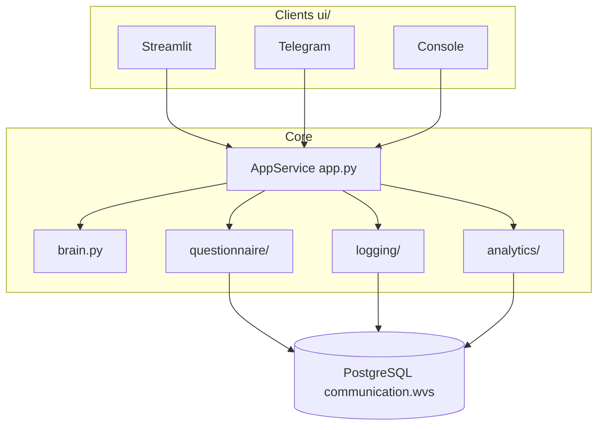

# wvs_bot

**Interactive survey bot for the [World Values Survey](https://www.worldvaluessurvey.org/) (WVS) framework.**  
Participants answer a short questionnaire and get immediate feedback: value indices, nearest country, and their place relative to a large reference sample.

**Architecture:** [`docs/ARCHITECTURE.md`](docs/ARCHITECTURE.md) · **Backlog:** [`docs/BACKLOG.md`](docs/BACKLOG.md) · **Deploy:** [`deploy/DEPLOY.md`](deploy/DEPLOY.md)

---

## What problem does this solve?

Social science needs both **data collection** and **instant feedback** for respondents. This project:

- collects answers to a WVS-style questionnaire;
- stores them in PostgreSQL for research;
- returns quick, personalized results (Inglehart–Welzel-style indices and comparisons).

It is **not** the official WVS platform. It reuses WVS concepts and reference data for education and pilot studies.

---

## Research background

| Topic | Link |
|--------|------|
| World Values Survey (official site) | https://www.worldvaluessurvey.org/ |
| WVS documentation & waves | https://www.worldvaluessurvey.org/WVSEVdocumentation.jsp |
| Inglehart–Welzel cultural map (method) | https://www.worldvaluessurvey.org/WVSOnline.jsp?WVS=IGUANAWELZEL |
| Inglehart & Welzel, *Foreign Affairs* (overview) | https://www.foreignaffairs.com/articles/2010-03-01/how-development-leads-democracy |

**Two dimensions used in this bot:**

- **RV** — Traditional vs secular-rational values  
- **SV** — Survival vs self-expression values  

Indices are computed in Python from 13 main questions (`core/analytics/indices.py`), aligned with the legacy SQL logic now archived in `old/count_ind.sql`.

---

## What the user can do

After entering a name, the main menu offers **five** actions:

| # | Feature | Description |
|---|---------|-------------|
| 0 | Learn more (FAQ) | Nine short Q&A about the survey and indices |
| 1 | Main questionnaire | 13 questions → `user_answers`; can pause and resume |
| 2 | Secondary questionnaire | 14 questions about the respondent → `user_reviews` |
| 3 | Find a country | Nearest country by RV/SV + profile card + **plot** (Streamlit & Telegram) |
| 4 | Your place in society | Percentiles vs WVS sample, peers by age/gender, vs other bot users + **histograms** |

Items 3 and 4 are locked until the main questionnaire is complete. Item 4 also needs the secondary questionnaire (country, birth year, gender).

**Interfaces:** Streamlit (web), Telegram (aiogram, text + PNG charts), console (text only). One interface per process — set `app.interface` in `config.yaml`.

---

## Architecture (overview)



- **UI** renders text/buttons/charts only; calls `AppService.handle_action` / `handle_start`.
- **brain** builds `AppResponse` (text, buttons, screen, meta) without database or network.
- **AppService** orchestrates questionnaires, events, analytics.
- **Texts** live in `data/dialog_messages.json`; **questions** in `questions.json`.

Full module catalog: [`docs/ARCHITECTURE.md`](docs/ARCHITECTURE.md).

---

## Quick start (developers)

```bash
cd /path/to/wvs_bot
python3 -m venv .venv && source .venv/bin/activate
pip install -r requirements.txt
cp config.example.yaml config.yaml   # logging.password, optional telegram.token

python3 scripts/setup_reference_tables.py   # needs gen_sample.csv, country_data.csv in project root
streamlit run ui/streamlit_app.py
# or: python3 main.py   # uses app.interface from config.yaml
```

**Tests:** `./pre_commit_check.sh` (pytest + `business_checks.py`).

**Branches:** `main` → prod VM, `dev` → local/stage. Same DB name `communication`, schema `wvs`; servers differ.

---

# wvs_bot — описание на русском

## О чём этот проект

**wvs_bot** — инструмент для участия в опросе в духе [World Values Survey](https://www.worldvaluessurvey.org/).

Человек отвечает на анкету и сразу получает обратную связь: индексы RV/SV, ближайшую страну, место среди выборки WVS и среди других пользователей бота. Ответы сохраняются в PostgreSQL для исследований.

---

## Что умеет бот

1. **Старт** — имя (в Telegram: подтверждение `@username`).
2. **Главное меню** — FAQ + две анкеты + две аналитические функции (см. таблицу выше).
3. **Графики** — карта стран и гистограммы «своё место» в Streamlit (Plotly) и Telegram (PNG).
4. **Логирование** — `users`, `events`, ответы; можно отключить (`logging_enabled: false`).

---

## Структура репозитория

| Путь | Назначение |
|------|------------|
| `core/` | Бизнес-логика: app, brain, analytics, questionnaire, logging |
| `ui/` | Streamlit, Telegram, console |
| `data/` | Тексты, FAQ, профили стран |
| `scripts/` | Загрузка CSV, миграция legacy, утилиты |
| `deploy/` | nginx, systemd, лендинг |
| `docs/` | Архитектура, backlog |
| `tests/` | pytest |
| `old/` | MVP монолита (архив) |

---

## Запуск и конфиг

```yaml
# config.yaml
app:
  interface: streamlit   # streamlit | telegram | console
  logging_enabled: true
logging:
  host: ...
  database: communication
  schema: wvs
telegram:
  token: ...
  proxy_url: ...         # если api.telegram.org недоступен с VPS
```

---

## Тестирование

| Слой | Команда | Что проверяет |
|------|---------|----------------|
| 1 | `pytest tests/` | модули, индексы, сценарии, логирование |
| 2 | `python3 business_checks.py` | полный сценарий, события, id, спецсимволы, лаг in-memory |

---

## События в логах

`start_screen_visit`, `registration`, `main_menu_visit`, `main_menu_click`, `main_questionary_start`, `secondary_questionary_start`, `question_show`, `answer_sent`, `find_counry_start`, `find_own_place_start`, `country_plot_loaded`, `faq_menu_visit`, `faq_page_visit`, `analytics_error`.

Параметры — в [`task.md`](task.md) и [`docs/ARCHITECTURE.md`](docs/ARCHITECTURE.md).

---

## Продакшен

- **Streamlit:** https://streamlit.worldvaluessurveybot.info — `systemctl restart wvs-streamlit`
- **Лендинг:** https://worldvaluessurveybot.info — после `git pull` нужен `cp deploy/www/index.html /var/www/worldvaluessurveybot/`
- **Telegram:** отдельный процесс; unit пока не в репо (см. [`docs/BACKLOG.md`](docs/BACKLOG.md))

---

## Устаревший код

Первая монолитная версия — [`old/`](old/README.md). Рабочие точки входа: `main.py`, `ui/streamlit_app.py`, `ui/telegram_bot.py`, `ui/console_app.py`.

---

## Требования и backlog

Исходные принципы и цели — [`task.md`](task.md).  
Что из task.md ещё не реализовано — [`docs/BACKLOG.md`](docs/BACKLOG.md).
