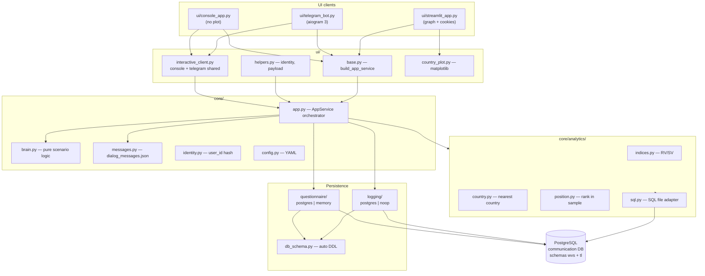
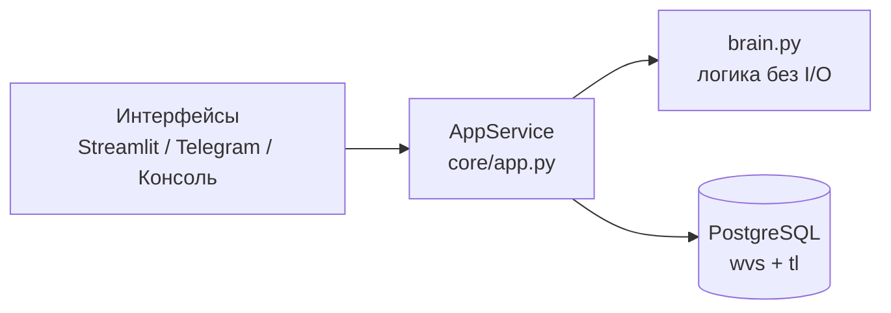

# wvs_bot

World Values Survey bot — a short questionnaire (13 main + 14 secondary questions) for Inglehart–Welzel value indices.

---

## Architecture



### Request flow (one user step)

1. UI reads input (button, text, Telegram message).
2. UI builds `payload` via `ui/helpers.py` and calls `AppService.handle_action` or `handle_start`.
3. `AppService` updates `users`, writes `events`, reads/writes answers, may call analytics SQL.
4. `brain.py` returns `AppResponse` (text, buttons, screen, meta) — no I/O inside brain.
5. UI renders response. Streamlit additionally draws the country plot when `meta.show_country_plot` is set.

### Branches

| Branch | Environment |
|--------|-------------|
| `main` | Production (VM) |
| `dev` | Local development |

Database name is always **`communication`**; app data lives in schema **`wvs`**, reference WVS sample in **`tl`**.

---

## Quick start

```bash
cd /home/roman/python/wvs_bot
python3 -m venv .venv
source .venv/bin/activate
pip install -r requirements.txt

cp config.example.yaml config.yaml
# set logging.password and optionally telegram.token

# reference CSVs in project root (gitignored):
python3 scripts/load_reference_data.py

# default UI — Streamlit
streamlit run ui/streamlit_app.py

# or set app.interface in config.yaml:
python3 main.py   # streamlit | telegram | console
```

### Configuration (`config.yaml`)

```yaml
app:
  interface: streamlit   # streamlit | telegram | console
  logging_enabled: true

logging:
  host: localhost
  port: 5432
  database: communication
  user: roman
  password: "..."
  schema: wvs

analytics:
  reference_schema: tl

telegram:
  token: "..."
```

---

## Modules

| Path | Role |
|------|------|
| `core/app.py` | Single entry for business logic; logging, questionnaires, analytics |
| `core/brain.py` | Screen texts and transitions (no DB/network) |
| `core/questionnaire/` | Main answers → `user_answers`, secondary → `user_reviews` |
| `core/analytics/indices.py` | RV/SV from answers (see below) |
| `core/analytics/country.py` | Nearest country SQL |
| `core/analytics/position.py` | User rank vs `gen_sample` |
| `data/dialog_messages.json` | All user-visible strings |
| `data/country_profiles.json` | Country cards after “Find country” |
| `questions.json` | Main + secondary questions |
| `business_checks.py` | Layer 2 business tests (`task.md`) |
| `old/` | Legacy monolith code (not used) |

---

## Why RV/SV are computed in Python (`indices.py`), not only in `count_ind.sql`

The legacy bot ran a large SQL script (`count_ind.sql`, kept for reference) on every index request. The new code uses **`core/analytics/indices.py`** instead:

1. **Same data, less round-trips** — answers are already loaded for the questionnaire; Python reuses `user_answers` without sending a 90-line SQL string to Postgres on each menu action.
2. **Easier to test** — `tests/test_indices.py` checks edge cases (Q17 text, “Не знаю”, negative numbers) without a database fixture.
3. **Explicit rules** — scoring rules for Q17 and numeric parsing live in one readable function; the SQL mixed parsing, CASE logic, and aggregation.
4. **Schema flexibility** — `adapt_sql` rewrites `tl.` prefixes; Python store abstracts postgres vs in-memory tests.
5. **Offline / noop logging** — indices work with `MemoryMainAnswerStore` in unit tests and `business_checks.py`.

SQL files remain for **analytics that need the full sample** (`find_country.sql`, `count_pos.sql`, `age_strat.sql`, `gender_age_strat.sql`) where joining `gen_sample` in the database is appropriate.

---

## Testing

**Layer 1** — pytest (required for commit):

```bash
./pre_commit_check.sh
```

**Layer 2** — business scenario checks from `task.md`:

```bash
python3 business_checks.py
```

Included checks: menu buttons, event logging, user id collisions, special characters in names, full scenario latency &lt; 8 s, country plot timing report.

---

## Logging events

`start_screen_visit`, `registration`, `main_menu_visit`, `main_menu_click`, `main_questionary_start`, `secondary_questionary_start`, `question_show`, `answer_sent`, `find_counry_start`, `find_own_place_start`, `country_plot_loaded` (with timing fields in Streamlit).

---

# wvs_bot (русский)

Бот Всемирного исследования ценностей — короткая анкета (13 основных + 14 дополнительных вопросов) для индексов Инглхарта–Вельцеля.

---

## Архитектура

Схема та же, что в английской части выше. Кратко по слоям:



- **Интерфейсы** только показывают текст и кнопки и передают ввод в `AppService`.
- **Мозг** (`brain.py`) не ходит в БД и не знает про Telegram/Streamlit.
- **AppService** пишет `users` и `events`, ведёт анкеты, вызывает аналитику.
- **Консоль и Telegram** не рисуют график страны — только текст и карточка из JSON.
- **Streamlit** дополнительно строит matplotlib-график и логирует тайминги `country_plot_loaded`.

### Поток одного шага пользователя

1. UI получает ввод.
2. Формируется `payload`, вызывается `handle_start` / `handle_action`.
3. Обновляется пользователь, пишется событие, при необходимости — ответ в анкету или SQL-аналитика.
4. `brain` возвращает `AppResponse`.
5. UI отображает ответ (в Streamlit при «Найти страну» — ещё график).

---

## Быстрый старт

```bash
cd /home/roman/python/wvs_bot
python3 -m venv .venv
source .venv/bin/activate
pip install -r requirements.txt
cp config.example.yaml config.yaml

python3 scripts/load_reference_data.py   # gen_sample.csv, country_data.csv в корне
streamlit run ui/streamlit_app.py
```

Переключение интерфейса в `config.yaml` → `app.interface`: `streamlit`, `telegram`, `console`, либо `python3 main.py`.

---

## Почему индексы RV/SV считаются в Python, а не в `count_ind.sql`

В старом боте при каждом запросе выполнялся большой SQL (`count_ind.sql`, лежит в корне для справки). Сейчас расчёт в **`core/analytics/indices.py`**:

1. **Меньше обращений к БД** — ответы уже есть в хранилище анкеты.
2. **Проще тестировать** — граничные случаи Q17 и «Не знаю» в `tests/test_indices.py` без Postgres.
3. **Правила на виду** — парсинг чисел и особые вопросы в одном месте, а не в длинном SQL.
4. **Гибкость схем** — тот же код для postgres и memory-store в тестах.
5. **Работа без БД** — индексы считаются в `business_checks` и unit-тестах.

SQL-файлы остаются там, где нужна **большая выборка** (`gen_sample`): поиск страны, позиция в социуме.

---

## Тестирование

| Слой | Команда | Содержание |
|------|---------|------------|
| 1 | `pytest tests/` | Модули, brain, app, логирование |
| 2 | `python3 business_checks.py` | Сценарий, события, коллизии id, спецсимволы, лаг &lt; 8 с |

Полная проверка перед коммитом: `./pre_commit_check.sh`.

---

## События логирования

См. `task.md`. Опечатка в имени события сохранена намеренно: `find_counry_start`.

---

## Устаревший код

Файлы прежней монолитной версии — в каталоге [`old/`](old/README.md). Точка входа сейчас: `ui/streamlit_app.py`, `ui/console_app.py`, `ui/telegram_bot.py`, `main.py`.
